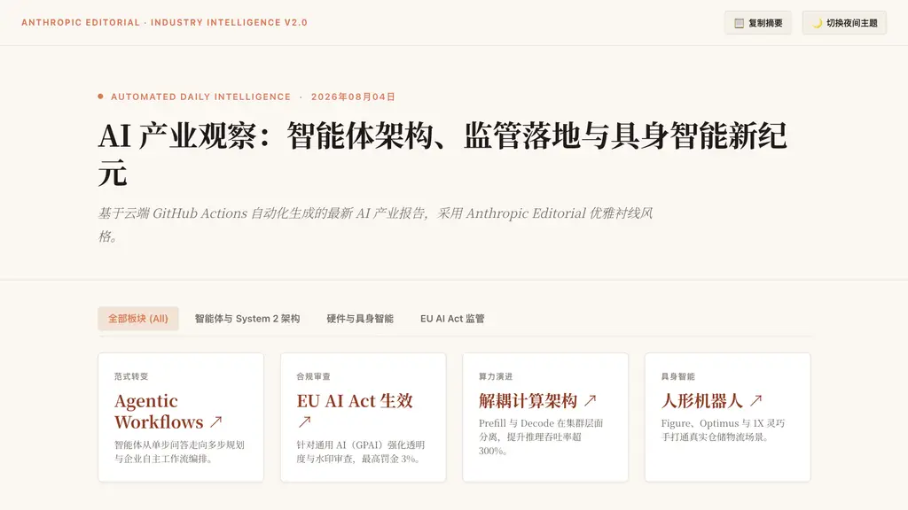
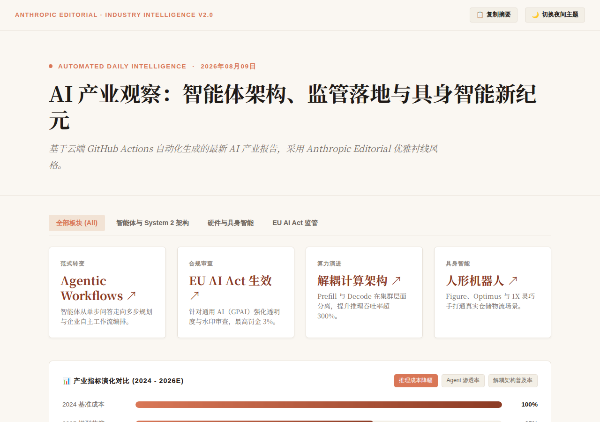
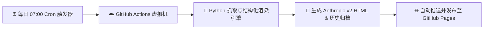

<div align="center">

# 🤖 全自动 AI 产业每日观察与深度分析

<p align="center">
  <b>基于云端 GitHub Actions 无人值守自动化的 AI 产业情报日报系统</b>
</p>

[](https://github.com/chenzh659/ai-daily-report/actions/workflows/daily_report.yml)
[](https://chenzh659.github.io/ai-daily-report/)
[](https://chenzh659.github.io/ai-daily-report/)
[](https://www.python.org/)
[](LICENSE)

<br />

[🌐 在线即刻阅读网页版](https://chenzh659.github.io/ai-daily-report/) · [💬 提交建议/Issue](https://github.com/chenzh659/ai-daily-report/issues)

</div>

---

## 🖼️ 页面效果预览 (Live Preview)

下图为每日自动化生成的 **Anthropic 暖沙衬线社论风格** HTML 控制台控制界面：

<div align="center">
  
</div>


---

## 📰 今日最新报告快照 (Today's Report)

*下图为 GitHub Actions 机器人每天早晨自动拍摄的最新报告快照，内容与线上同步更新：*

<div align="center">
  
</div>

---

## ✨ 核心亮点

- 🎨 **Anthropic 品牌级美学**：摒弃传统黑客风，采用暖沙色纸质背景（`#FAF7F2`）、赤陶珊瑚红（`#D97757`）与经典衬线字体（Noto Serif SC / Merriweather）。
- 🌓 **Anthropic Daylight / Dusk 架构**：支持在**日光暖沙**与**夜间深炭**模式无缝平滑切换。
- 📊 **多维交互与动态可视化**：
  - 顶部实时滚动阅读进度条；
  - 2024–2026E 产业推理成本、Agent 渗透率动态对比条形图；
  - 模块化收纳的技术可折叠卡片（Accordions）；
  - 一键复制日报摘要并带 Toast 提示。
- ⚙️ **完全无感云端运行**：基于 GitHub Actions 每天北京时间**早 7:00** 自动抓取最新大模型、智能体、硬件与监管资讯并同步发布至 GitHub Pages。

---

## 🔄 系统运行架构 (Architecture)



---

## 📁 目录结构

```text
ai-daily-report/
├── .github/
│   └── workflows/
│       └── daily_report.yml       # ⏰ 定时任务工作流 (每天早 7:00)
├── generate_report.py             # 🐍 自动抓取与 HTML 渲染主脚本
├── index.html                     # 🌐 当前最新日报主页
├── assets/
│   └── preview.png                # 🖼️ README 预览截图
├── reports/                       # 📂 历史日报档案馆
│   └── 2026-08-04.html
└── README.md
```

---

<div align="center">
  <sub>Built with ❤️ using Anthropic Editorial Design Principles. Automate your daily intelligence.</sub>
</div>
